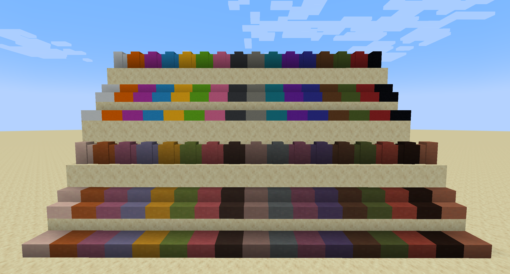

# More Terracotta

---

This mod is still a work in progress, but I plan on quickly finishing it for 1.18. 
Once I start playing 1.19 I will most likely update it to that version.

Welcome to More Terracotta. 
I've made this mod because I wanted more variations of terracotta and concrete in the game. 
This mod will add slabs, walls, and stairs for all versions of terracotta and concrete.

## Dependencies

This mod requires that you have the Fabric Loader installed and is made for Minecraft 1.18.2. 

Just place the mod in your mods folder and it should work.
